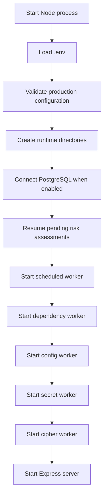
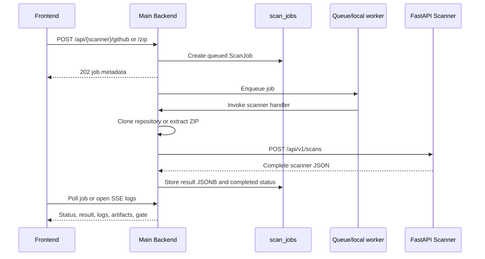
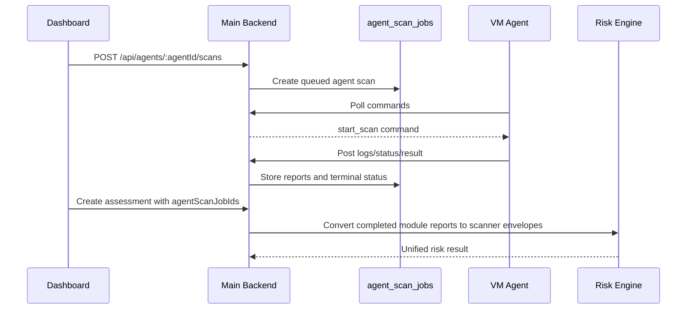
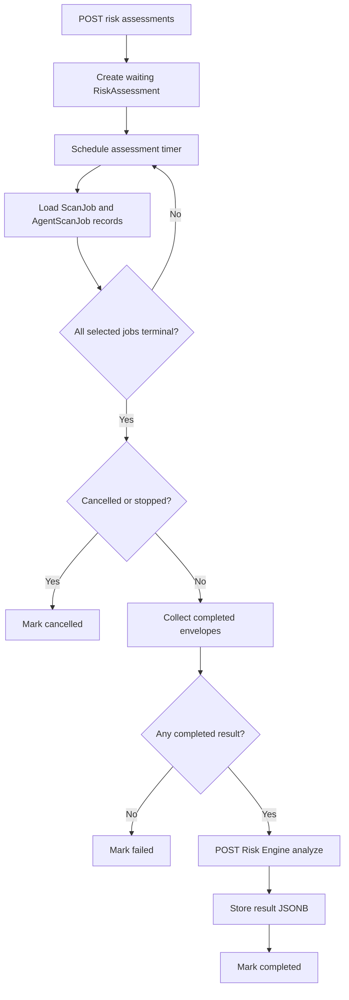

# Main Backend Scanner and Risk Flow

This document describes how the current `main-backend` connects the dashboard,
repository sources, VM agents, four scanner services, queues, PostgreSQL, the
Risk Engine, reports, and scheduled scans. It documents the implementation that
currently exists in this repository, not a hypothetical future architecture.

## 1. System role

The main backend is the orchestration layer. It authenticates requests, creates
and updates jobs, imports source code, calls scanner services, stores scanner
JSON, exposes logs/artifacts/gates, combines scanner results through the Risk
Engine, and persists risk assessments.

| Component | Default | Main backend integration |
|---|---:|---|
| Dependency Scanner | `8001` | `services/dependencyScannerService.js` |
| Configuration Scanner | `8002` | `services/configScannerService.js` |
| Secret Scanner | `8003` | `services/secretScannerService.js` |
| Pre-Cipher Scanner | `8004` | `services/cipherScannerService.js` |
| Risk Engine | `8005` | `services/riskEngineService.js` |
| Database | PostgreSQL | Sequelize models and `scanJobStore.js` |
| Queue | Redis/Upstash or local | scanner-specific queue services |

Defaults and service tokens are configured in
[`config/env.js`](C:\Users\hp\OneDrive\Desktop\open_source\uco-hakethon-s2\main-backend\config\env.js).

## 2. Startup flow

Startup is controlled by
[`server.js`](C:\Users\hp\OneDrive\Desktop\open_source\uco-hakethon-s2\main-backend\server.js):



The Express app in
[`app.js`](C:\Users\hp\OneDrive\Desktop\open_source\uco-hakethon-s2\main-backend\app.js)
adds Helmet, CORS, a 50 MB JSON limit, webhook raw-body capture, URL-encoded
parsing, rate limiting, request logging, `/api` routes, and centralized errors.

If `DB_ENABLED=false`, development fallback stores may use memory. If Redis is
disabled, scanner queues use their local fallback or direct in-process execution
depending on the scanner.

## 3. Route map

All routes are mounted below `/api` by
[`routes/index.js`](C:\Users\hp\OneDrive\Desktop\open_source\uco-hakethon-s2\main-backend\routes\index.js).

### Repository scanners

| Scanner | Routes |
|---|---|
| Dependency | `GET /scans`, `GET /scans/:id`, `GET /scans/:id/logs`, `GET /scans/:id/artifacts/:format`, `GET /scans/:id/gate`, `POST /scans/github`, `POST /scans/zip` |
| Config | `GET /config-scans`, `GET /config-scans/:id`, `GET /config-scans/:id/logs`, `POST /config-scans/:id/cancel`, `POST /config-scans/github`, `POST /config-scans/zip` |
| Secret | `GET /secret-scans`, `GET /secret-scans/:id`, `GET /secret-scans/:id/logs`, `GET /secret-scans/:id/artifacts/:format`, rotation endpoints, `POST /secret-scans/github`, `POST /secret-scans/zip` |
| Cipher | `GET /cipher-scans`, `GET /cipher-scans/:id`, `GET /cipher-scans/:id/logs`, `POST /cipher-scans/:id/notify`, `POST /cipher-scans/github`, `POST /cipher-scans/zip` |

### Risk, agents, and schedules

| Area | Routes |
|---|---|
| Risk | `GET /risk/business-inputs`, `POST /risk/overview`, assessment create/list/read/remedies/PDF |
| Agents | registration, heartbeat, command polling, logs/status/results, dashboard scan create/stop/read |
| Schedules | CRUD under `/scheduled-scans` plus `POST /scheduled-scans/:id/run-now` |
| Webhooks | Signed provider events under `/webhooks/:provider` for dependency and secret scans |

Dashboard routes use `requireAuth`. Agent callbacks use `requireAgentToken`.
Provider webhooks use provider signature verification.

## 4. Common repository scan lifecycle



The common steps are:

1. Create a `ScanJob` with status `queued`.
2. Return `202 Accepted` to the caller.
3. Resolve provider credentials at execution time.
4. Clone GitHub/provider source or extract the ZIP into a job workspace.
5. Call the relevant FastAPI scanner with a local path or live targets.
6. Add orchestration metadata such as scanner URL and duration.
7. Store the complete result in `scan_jobs.result`.
8. Mark the job `completed` or `failed`.
9. Remove uploaded ZIP files in cleanup blocks.
10. Optionally send audit, email, notification, artifact, or finding updates.

The main backend passes paths and options to scanners; scanners do not query the
main backend database directly.

## 5. Dependency Scanner

Implementation files:

- Controller: [`controllers/scanController.js`](C:\Users\hp\OneDrive\Desktop\open_source\uco-hakethon-s2\main-backend\controllers\scanController.js)
- Client: [`services/dependencyScannerService.js`](C:\Users\hp\OneDrive\Desktop\open_source\uco-hakethon-s2\main-backend\services\dependencyScannerService.js)
- Queue: [`services/redisScanQueue.js`](C:\Users\hp\OneDrive\Desktop\open_source\uco-hakethon-s2\main-backend\services\redisScanQueue.js)

Request sent to `POST ${DEPENDENCY_SCANNER_URL}/api/v1/scans`:

```json
{
  "project_path": "<job-workspace>",
  "include_dev": true,
  "use_osv": true,
  "fail_on": "high",
  "max_depth": 8
}
```

The client timeout is 120 seconds. `SCANNER_API_TOKEN`, when configured, is
sent as `x-scanner-token`.

The stored result contains vulnerabilities, dependency risks, capability
findings, malware/behavior/package intelligence, namespace risks, risk chains,
artifact metadata, and summary. The dependency gate allows only when:

```text
summary.ci_status == "passed"
AND summary.banking_action != "block"
```

Dependency provider webhooks can create jobs without a dashboard user. Delivery
IDs provide duplicate suppression.

## 6. Configuration Scanner

Implementation files:

- Controller: [`controllers/configScanController.js`](C:\Users\hp\OneDrive\Desktop\open_source\uco-hakethon-s2\main-backend\controllers\configScanController.js)
- Client: [`services/configScannerService.js`](C:\Users\hp\OneDrive\Desktop\open_source\uco-hakethon-s2\main-backend\services\configScannerService.js)
- Queue: [`services/configScanQueue.js`](C:\Users\hp\OneDrive\Desktop\open_source\uco-hakethon-s2\main-backend\services\configScanQueue.js)

Request sent to `POST ${CONFIG_SCANNER_URL}/api/v1/scans`:

```json
{
  "project_path": "<job-workspace>",
  "fail_on": "high",
  "max_depth": 12,
  "include_low": true,
  "runtime_snapshot_path": null,
  "policy_path": null
}
```

The default client timeout is 330 seconds and can be changed with
`CONFIG_SCANNER_CLIENT_TIMEOUT_MS`. A configured service token is sent as
`x-scanner-service-token`.

The result preserves findings, normalized facts, config graph, environment and
runtime drift, attack paths, remediation plan, policy decision, compliance
mapping, evidence bundle, SARIF, and summary. Config scans enforce per-user and
global active-job capacity and support cancellation checks during execution.

## 7. Secret Scanner

Implementation files:

- Controller: [`controllers/secretScanController.js`](C:\Users\hp\OneDrive\Desktop\open_source\uco-hakethon-s2\main-backend\controllers\secretScanController.js)
- Client: [`services/secretScannerService.js`](C:\Users\hp\OneDrive\Desktop\open_source\uco-hakethon-s2\main-backend\services\secretScannerService.js)
- Queue: [`services/secretScanQueue.js`](C:\Users\hp\OneDrive\Desktop\open_source\uco-hakethon-s2\main-backend\services\secretScanQueue.js)
- Findings: [`services/secretFindingStore.js`](C:\Users\hp\OneDrive\Desktop\open_source\uco-hakethon-s2\main-backend\services\secretFindingStore.js)
- Rotation: [`services/secretRotationService.js`](C:\Users\hp\OneDrive\Desktop\open_source\uco-hakethon-s2\main-backend\services\secretRotationService.js)

Request sent to `POST ${SECRET_SCANNER_URL}/api/v1/scans`:

```json
{
  "project_path": "<job-workspace>",
  "fail_on": "high",
  "max_depth": 14,
  "include_low": true,
  "scan_binary_files": false,
  "include_git_history": true,
  "max_history_commits": 100,
  "complete_git_history": false,
  "changed_files": null,
  "max_file_bytes": 5000000,
  "max_files": 8000,
  "max_total_bytes": 1000000000
}
```

The client calls `${SECRET_SCANNER_URL}/api/v1/scans` with a 120-second timeout
and sends `x-scanner-token`. The result preserves secret risk, findings,
exposure paths, rotation playbooks, secret graph, policy decision, sensitive
data, historical exposures, compromised matches, usage paths, and summary.

Secret findings are additionally persisted in the backend finding store.
Rotation requests do not transmit raw secret values through the rotation
workflow. Rotation can require approval and remain dry-run until a broker and
execution setting are configured.

## 8. Pre-Cipher Scanner

Implementation files:

- Controller: [`controllers/cipherScanController.js`](C:\Users\hp\OneDrive\Desktop\open_source\uco-hakethon-s2\main-backend\controllers\cipherScanController.js)
- Client: [`services/cipherScannerService.js`](C:\Users\hp\OneDrive\Desktop\open_source\uco-hakethon-s2\main-backend\services\cipherScannerService.js)
- Queue: [`services/cipherScanQueue.js`](C:\Users\hp\OneDrive\Desktop\open_source\uco-hakethon-s2\main-backend\services\cipherScanQueue.js)
- Asset scans: [`services/cipherAssetScanService.js`](C:\Users\hp\OneDrive\Desktop\open_source\uco-hakethon-s2\main-backend\services\cipherAssetScanService.js)

Cipher supports repository scans and direct live asset targets. For asset scans
there may be no project path.

Request sent to `POST ${CIPHER_SCANNER_URL}/api/v1/scans`:

```json
{
  "project_path": "<job-workspace-or-null>",
  "fail_on": "high",
  "max_depth": 14,
  "max_files": 8000,
  "max_file_size_bytes": 5000000,
  "targets": [],
  "scan_mode": "incremental",
  "cache_namespace": "default",
  "include_low": true,
  "banking_profile": "strict",
  "enable_live_probe": true,
  "live_probe_timeout_seconds": 2.5,
  "max_live_probe_endpoints": 8
}
```

The client timeout is 120 seconds and sends `X-Scanner-Token` when configured.
The result preserves TLS facts, endpoint policies, domain inventory, live
probes, attack paths, policy graph, environment drift, agility and compatibility
risks, mTLS readiness, deployment readiness, remediation plan, policy decision,
compliance mapping, policy pack, and summary.

After completion, enterprise cipher notifications and optional email reports
may be generated.

## 9. Queue and worker behavior

### Redis/Upstash mode

When Redis is enabled and strict-offline policy permits metadata queues, the
backend uses Redis Streams or Upstash Streams. Workers use consumer groups,
configurable concurrency, pending-message claiming, retries, acknowledgements,
and dead-letter streams.

Default stream families are:

```text
bugbusters:scan-jobs
bugbusters:config-scan-jobs
bugbusters:secret-scan-jobs
bugbusters:cipher-scan-jobs
bugbusters:scheduled-scans
```

Provider credentials are removed from queue payloads. Workers resolve them at
execution time.

### Local/offline mode

- Config and secret queues persist metadata-only tasks under workspace queue
  directories and run bounded local workers.
- Cipher uses its queue implementation with local fallback behavior.
- Dependency scanning falls back to in-process execution when Redis is disabled.
- Scheduled scans run directly when a Redis schedule queue cannot be used.

Local queues are single-process mechanisms. They are not a substitute for a
distributed queue when multiple backend instances share production workload.

## 10. Scan job persistence

The primary model is
[`models/ScanJob.js`](C:\Users\hp\OneDrive\Desktop\open_source\uco-hakethon-s2\main-backend\models\ScanJob.js).

Important fields include:

```text
id, userId, scannerType, sourceType, sourceLabel, repoUrl, commitSha,
deliveryId, departmentId, status, cancelRequested, result JSONB, error,
completedAt, createdAt, updatedAt
```

Normal states are:

```text
queued -> running -> completed
                    -> failed
                    -> cancelled
```

The complete scanner response is stored in JSONB. With `DB_ENABLED=false`, the
development fallback can store jobs in memory, which loses state after restart.

## 11. VM agent flow

VM scans use `AgentScanJob` and agent commands instead of directly invoking all
four scanner HTTP services from the request thread.



Agent modules are dependency, config, secret, and cipher. Results are expected
to contain a `reports` array. Each completed report becomes a scanner envelope
with synthetic ID `<agentJobId>:<module>:<reportIndex>`.

## 12. Risk overview flow

[`services/riskEngineService.js`](C:\Users\hp\OneDrive\Desktop\open_source\uco-hakethon-s2\main-backend\services\riskEngineService.js)
implements the immediate overview:

1. Read up to 300 jobs for the authenticated user.
2. Keep completed dependency/config/secret/cipher jobs.
3. Group by `sourceType:sourceLabel`.
4. Select the requested source or newest group.
5. Select the latest job per scanner.
6. Convert jobs to `scanner_jobs` envelopes.
7. Normalize business-context field names.
8. POST to `${RISK_ENGINE_URL}/api/v1/risk/analyze`.
9. Return risk data plus selected jobs, missing scanners, and duration.

The Risk Engine is not called automatically after every individual scan. It is
called by the overview, persisted assessment, and report workflows.

## 13. Persisted risk-assessment flow

[`services/riskAssessmentService.js`](C:\Users\hp\OneDrive\Desktop\open_source\uco-hakethon-s2\main-backend\services\riskAssessmentService.js)
creates an assessment with `waiting` status and selected scanner/agent job IDs.



The model is [`models/RiskAssessment.js`](C:\Users\hp\OneDrive\Desktop\open_source\uco-hakethon-s2\main-backend\models\RiskAssessment.js).
It stores user/source identity, scanner IDs, agent IDs, business context,
weights, status, result JSONB, errors, and timestamps.

Failed scanner jobs can be recorded as skipped while completed jobs are still
scored. Consumers must inspect both `result.input.skipped` and Risk Engine
coverage metadata.

On restart, waiting/running assessments are rescheduled by
`resumePendingAssessments()`.

## 14. Scheduled scan flow

Schedules are stored in
[`models/ScheduledScan.js`](C:\Users\hp\OneDrive\Desktop\open_source\uco-hakethon-s2\main-backend\models\ScheduledScan.js)
and executed by
[`services/scheduledScanService.js`](C:\Users\hp\OneDrive\Desktop\open_source\uco-hakethon-s2\main-backend\services\scheduledScanService.js).

Each schedule can define source, repository/agent, paths, scope, scanners,
frequency, time zone, business context, email, and last-run IDs.

Execution:

1. Find enabled due schedules.
2. Prevent duplicate runs using `running` and active-run state.
3. Create jobs for the configured scanner list.
4. Wait for scanner jobs to complete.
5. Create a risk assessment from the resulting IDs.
6. Wait for the assessment.
7. Store last assessment/job IDs and status.
8. Send an optional report email.
9. Calculate the next run time.

Redis scheduling uses a stream/consumer group. Local mode invokes the schedule
runner directly in the Node process.

## 15. Provider webhook flow

Signed provider webhooks:

1. Capture the raw request body.
2. Verify the provider signature.
3. Normalize repository, ref, commit, and changed-file data.
4. Calculate a delivery ID and suppress duplicates.
5. Create a dependency or secret job.
6. Enqueue the job or use local fallback.
7. Return `202 Accepted`.

Dependency and secret webhook handling is in
[`controllers/webhookController.js`](C:\Users\hp\OneDrive\Desktop\open_source\uco-hakethon-s2\main-backend\controllers\webhookController.js).

## 16. Logs, artifacts, gates, and reports

Controllers write progress messages through `logStreamService.js`. Job log
endpoints stream new messages with Server-Sent Events.

`scanArtifactService.js` converts stored results into download formats.

Scanner CI gates use scanner summaries. The dependency gate, for example,
requires `ci_status=passed` and `banking_action` other than `block`.

The unified Risk Engine final score is a separate decision object from each
scanner's CI gate. Completed risk assessments can produce PDFs through
`riskReportPdfService.js`, emails through `mailService.js`, and remediation
through the Risk Engine remedies endpoints.

## 17. Authentication and ownership

Dashboard routes use JWT/session authentication. Job reads check the requesting
user ID and return `404` for inaccessible jobs. Agent callbacks use an agent
shared token. Webhooks use provider signatures.

PostgreSQL-backed ownership is the production path. Memory fallback is for
development only.

## 18. Failure and recovery

- Scanner HTTP errors are sanitized, logged, and stored as failed jobs.
- Redis workers retry and eventually publish dead-letter messages.
- Config/secret/cipher local queues have bounded capacity and local retry/dead-letter behavior where implemented.
- Dependency falls back to direct execution when Redis is disabled.
- Uploaded ZIP files are removed during controller cleanup.
- Cancelled or stopped selected jobs cancel an assessment rather than scoring it.
- A failed Risk Engine request fails the assessment.
- Email, notification, AI, and rotation failures normally do not invalidate an already-completed scanner result.

## 19. Integration boundaries

The main backend is the only component that reads `scan_jobs` and
`risk_assessments`. Scanner services receive HTTP requests and return JSON.
The Risk Engine receives completed scanner envelopes, not queue messages.

The backend preserves scanner-specific JSON in JSONB and uses normalized Risk
Engine output for cross-scanner reporting. Missing scanners are surfaced as
incomplete evidence; they are not automatically equivalent to clean scans.

## 20. Important configuration

```text
PORT
DB_ENABLED, DATABASE_URL, DB_SSL
REDIS_ENABLED, REDIS_URL, Upstash credentials
SCAN_WORKER_CONCURRENCY
DEPENDENCY_SCANNER_URL
CONFIG_SCANNER_URL
SECRET_SCANNER_URL
CIPHER_SCANNER_URL
RISK_ENGINE_URL
SCANNER_API_TOKEN
CONFIG_SCANNER_SERVICE_TOKEN
CIPHER_SCANNER_API_TOKEN
JWT_SECRET, AGENT_SHARED_TOKEN
GITHUB_* provider configuration
SECRET_ROTATION_* broker configuration
SMTP_* mail configuration
```

Exact defaults, queue names, retry limits, strict-offline behavior, and local
queue paths are defined in
[`config/env.js`](C:\Users\hp\OneDrive\Desktop\open_source\uco-hakethon-s2\main-backend\config\env.js).

## 21. Production notes

- Use PostgreSQL rather than memory fallback.
- Use Redis/Upstash consumer groups for multiple backend instances.
- Monitor queue retries, pending claims, and dead-letter streams.
- Keep provider credentials out of queues and logs.
- Keep scanner gates and unified Risk Engine decisions separate in audit records.
- Treat partial scanner coverage as reduced assurance.
- Externalize shared workspaces when deploying multiple instances.
- Require service authentication, mTLS, durable audit logs, backups, and
  operational metrics for banking production.

